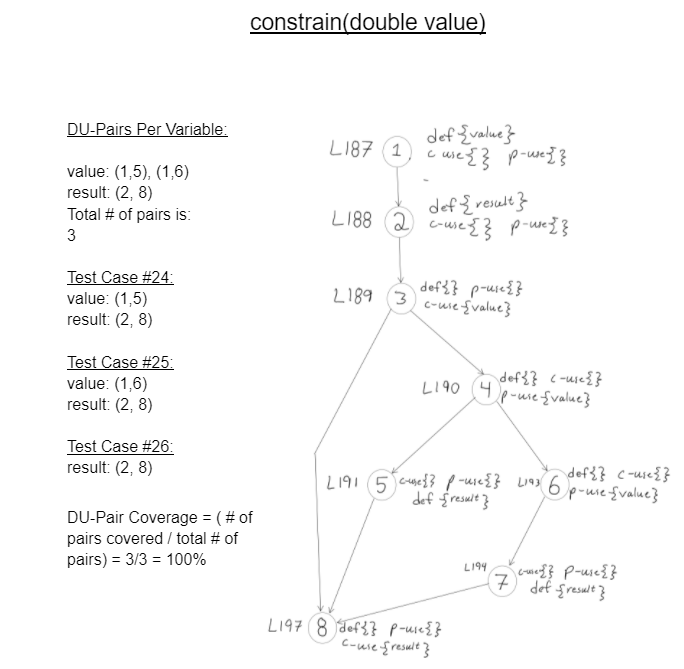
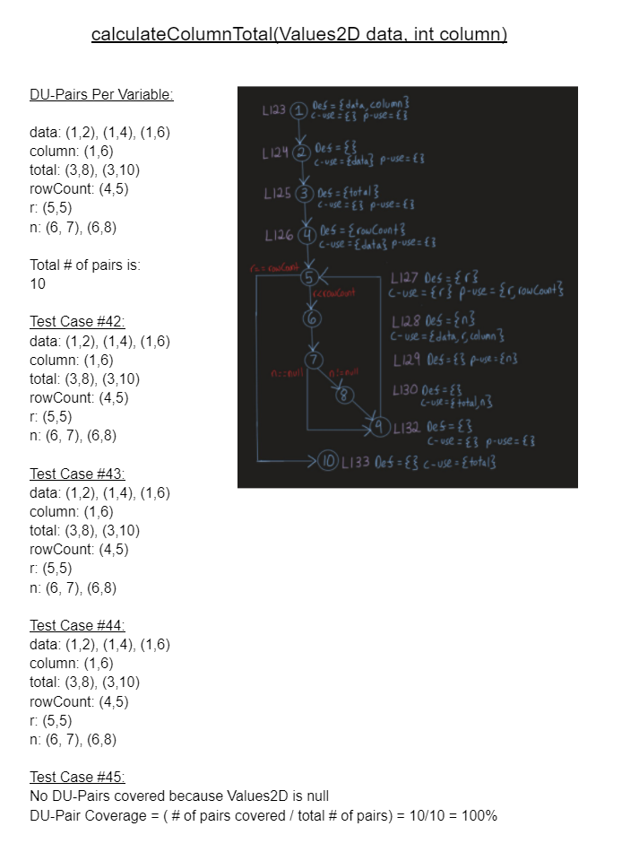
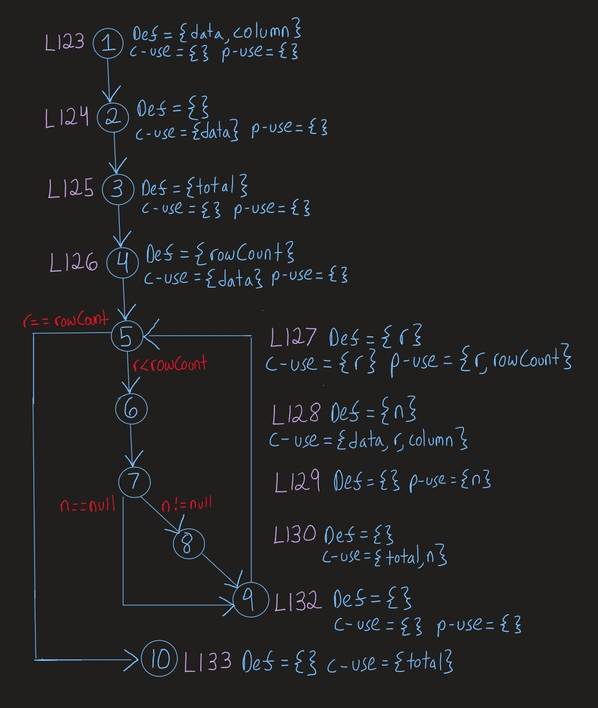
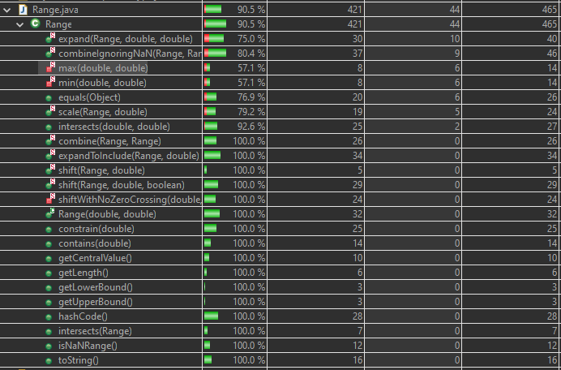
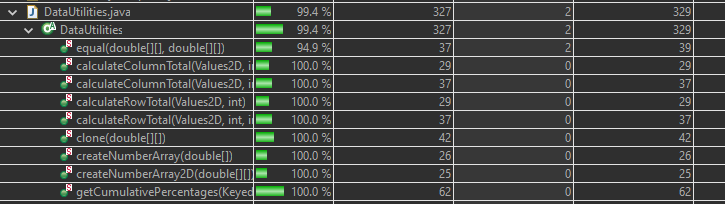
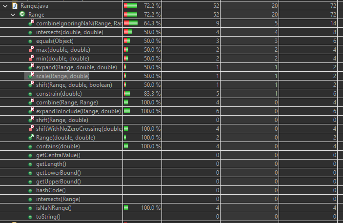
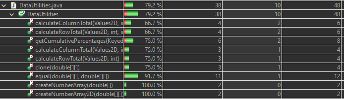
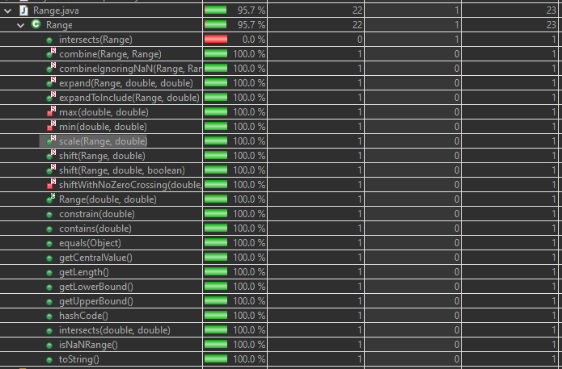
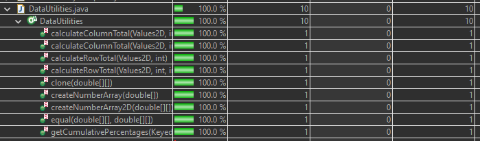

**SENG 438 - Software Testing, Reliability, and Quality**

> **Assignment #3**

**Lab. Report #3 – Code Coverage, Adequacy Criteria and Test Case Correlation**

| Group \#:       | G38  |
|-----------------|---|
| Student Names:  | Tony Vo, Chace Nielson, Chad Holst, Olisehemeka Chukwuma |

**Table of Contents**

- [1 Introduction](#1-introduction)

- [2 Manual data-flow coverage calculations for Constrain and CalculateColumnTotal methods](#2-manual-data-flow-coverage-calculations-for-constrain-and-calculatecolumntotal-methods)

- [3 A detailed description of the testing strategy for the new unit test](#3-a-detailed-description-of-the-testing-strategy-for-the-new-unit-test)

- [4 A high level description of five selected test cases you have designed using coverage information, and how they have increased code coverage](#4-a-high-level-description-of-five-selected-test-cases-you-have-designed-using-coverage-information-and-how-they-have-increased-code-coverage)

- [5 A detailed report of the coverage achieved of each class and method](#5-a-detailed-report-of-the-coverage-achieved-of-each-class-and-method-a-screen-shot-from-the-code-cover-results-in-green-and-red-color-would-suffice)

- [6 Pros and Cons of coverage tools used and Metrics you report](#6-pros-and-cons-of-coverage-tools-used-and-metrics-you-report)

- [7 A comparison on the advantages and disadvantages of requirements-based test generation and coverage-based test generation.](#7-a-comparison-on-the-advantages-and-disadvantages-of-requirements-based-test-generation-and-coverage-based-test-generation)

- [8 A discussion on how the team work/effort was divided and managed](#8-a-discussion-on-how-the-team-workeffort-was-divided-and-managed)

- [9 Any difficulties encountered, challenges overcome, and lessons learned from performing the lab](#9-any-difficulties-encountered-challenges-overcome-and-lessons-learned-from-performing-the-lab)

- [10 Comments/feedback on the lab itself](#10-commentsfeedback-on-the-lab-itself)

- [Appendix A: Full test suite of Assignment 3](#appendix-a-full-test-suite-of-assignment-3)

# 1 Introduction

In this assignment, we were tasked with using the white-box coverage criteria technique to develop test cases in order to increase the coverage of the test suites we developed in the previous assignment. The same Java framework from the last assignment, JFreeChart, was used for the system under test(SUT), and coverage tools such as EclEmma and Clover were employed to calculate the statement, branch, and method coverage for our test suite. 

After the completion of this assignment, we became more familiar with using coverage tools to measure test suite adequacy and were able to modify our test cases to improve code coverage. We became more acquainted with the advantages and disadvantages of each of the coverage tools we used and grew in our understanding of data-flow coverage and the manual calculation of DU-pair coverage.

# 2 Manual data-flow coverage calculations for Constrain and CalculateColumnTotal methods

This section includes the Data Flow diagrams and calculations for the following two methods: `constrain(double value)` from `Range` and `calculateColumnTotal(Values2D, int)` from `DataUtilities`.

# 3 A detailed description of the testing strategy for the new unit test

Our testing strategy was to use white-box testing to attempt to maximize the statement coverage, branch coverage, and method coverage of our unit tests from assignment 2 and new unit tests in our test suite. Our primary goal was to achieve a minimum of 90% statement coverage, 70% branch coverage, and 60% method coverage for each class under test. A secondary goal of ours was to achieve 100% statement coverage for our assignment 2 unit tests. We had modified our Assignment 2 tests and had achieved this goal through analyzing with the assistance of EclEmma and other coverage tools. Another secondary goal was to achieve 100% condition(method) coverage and around 80% branch coverage in DataUtilities which we were able to accomplish. Our strategy was to look at the source code with Eclemma to determine what statements, branches, and methods were missed. Eclemma highlights statements covered and notifies the user if a branch was missed and explains how many have been missed. We used this information as guidance to modify existing unit tests and create new unit tests. The guidance assisted us with deciding which inputs would satisfy each coverage metric percentage.

# 4 A high level description of five selected test cases you have designed using coverage information, and how they have increased code coverage

5 test cases that increased the coverage which are listed by method and test case number as each method has multiple tests are the following:

1. getCumulativePercentage(KeyedValues data) - Test 92

	Test 92 creates a mock that behaves as a KeyedValues object. The mock sets a key as 1 and a value as 5 in an Item in a list with an index of 0. When called, it returns a KeyedValues object with the value at index 0 changed to a cumulative percentage which is 1.0. The method reaches multiple branches to achieve coverage through the use of its inputs. Two if statements are covered but their “hidden” else statements are not. The two branches in each for loop are covered. This becomes a total of 6 branches covered. The test has 75% branch coverage and covers 6/8 branches. It has 100% statement coverage and 100% methods coverage based on the metrics for the method using Eclemma.
	
	
2. clone(double[][] array) - Test 91

	Test 91 clones a 2D double array and returns a 2D double array. The test contributes 75% branch coverage and covers 3/4 branches, 100% statement coverage, and 100% method coverage. The if statement is covered but not the “hidden” else statement. Additionally, the two branches involved in the for loop are covered involving its condition. This is a total of ¾ branches as expected. This is based on the metrics for the method using Eclemma using a single test to perform such coverage.

3. expandToInclude (Range range, double value) - Test 57

	Test 57 creates a range from -10 to 0 and expands it to include the number 2 in the upper bound using Range.expandToInclude(range,2); It then compares this new range to the range (-10, 2). It checks one of the 6 paths through the function. This test avoids triggering any of the exceptions or going through the if statement found in the source code. The test contributed 16.7% to branch coverage and 10.6% to statement coverage. This was calculated by removing the test from the test suite and calculating the difference from the total coverage of expandToInclude() which was previously at 100% for all metrics.

4. scale (Range base, double factor) - Test 50

	Test 50 creates a range from -10 to 10 and scales it by 2 using Range.scale(range,2); it then compares this new range to the range (-20, 20). It checks one of the 3 paths through the function. The “hidden” else statement is covered following the single if statement. This test avoids triggering any of the exceptions or going through the if statement found in the source code. This test contributed ⅓ of the total coverage of the scale method.

5. constrain(double value) - Test 102 

	Test 102 uses the already created Range of -100,000 to 100,000 and checks whether values sent as arguments that occur inside the range are also returned as the constrain value. In previous tests, the if(!contains(value)) statement is covered but not the hidden else statement after line 196 which is only covered when the value variable is within the range. This test sends a value within the range of -100,000 and 100,000 to check the hidden else statement thus increasing branch coverage. This test contributes ⅙ of the coverage of the constraint method.

# 5 A detailed report of the coverage achieved of each class and method (a screen shot from the code cover results in green and red color would suffice)

**Statement coverage:**

Range:

DataUtilities:

**Branch coverage**:

Range:

DataUtilities:

**Method coverage:**

Range:

DataUtilities:

# 6 Pros and Cons of coverage tools used and Metrics you report

The two coverage tools used were Clover and EclEmma. We had tried others such as CodeCover but we were unsuccessful with our version of Eclipse. While we used both coverage tools to help with writing tests we ended up using EclEmma to report our metrics.
The pros and cons of both tools are shown below:

<table>
  <tr>
   <td><b>Coverage Tool</b>
   </td>
   <td><b>Pros</b>
   </td>
   <td><b>Cons</b>
   </td>
  </tr>
  <tr>
   <td>Clover
   </td>
   <td>- Better user interface, which included better graphics and ways to display the data
   </td>
   <td>- Was more complicated to set up and run

- Had no condition coverage
   </td>
  </tr>
  <tr>
   <td>EclEmma
   </td>
   <td>- Simple to install and use

- Had statement and branch coverage

- Ran nicely on Eclipse

- good colour coding for visuals 

- report generation

- include/exclude 
   </td>
   <td>- Bar graphics were confusing and required some time and effort to understand what they were asking for

- Had no condition coverage
   </td>
  </tr>
</table>

# 7 A comparison on the advantages and disadvantages of requirements-based test generation and coverage-based test generation.

Requirements-based test generation is a black box principle. Simply put, it is generating your tests knowing the requirements of the source code and does not require you to actually see the source code. 

**Advantages**
- Easier to plan, requires a simple understanding of the requirements/goals of the function being tested
- It is explicit since the tests will be determined from formulas 
- They can be planned in advance of the actual code being finished 
- Boundary value tests catch errors

**Disadvantages**
- Easy to miss important aspects of the program like security
- Doesn’t check specific code segments
- Won’t check the program line by line 
- Test cases can be difficult to design for complicated systems 
- Number of test cases can become large for complicated functions 
- Limited knowledge of a programs inner workings may affect the quality of the tests

Coverage-based test generation is a white box principle. It is generating tests from the actual source code, 

**Advantages**
- Can check the program line by line for max coverage
- Can cover every path the program can take
- Checks specific code segments 
- The person designing the tests has an understanding of the code
- Allows understanding of the source code at a fundamental level to create tests that relate specifically to the code base

**Disadvantages**
- The code needs to be complete in order to generate tests for a system
- Requires specialised tools to complete effectively 
- Can have the number of tests grow exponentially
- Can have errors

Each method has its pros and cons. In this assignment, we used the test suite from assignment 2 and added to it to reach our coverage goals. It demonstrated how both methods can be more efficient when used together. We also noticed that a lot of methods derived from black-box principles were also derived from white box principles. This showed the overlap in methods and how they each relate to the concept of testing. 

# 8 A discussion on how the team work/effort was divided and managed

The lab was simpler to follow than previous labs and therefore was easier to split up among the teammates.
Section 3.1 was completed as a team as it involved understanding the coverage tools and was important for each team member to understand. As a group, we went through the suggested testing tools such as EclEmma, CodeCover, Clover, etc. We didn’t spend a lengthy amount of time on this section but once we felt we understood the assignment we split up the work for the remaining two sections.
Chace and Chad worked on the data flow graphs and calculations for the testing methods found in the “Manual data-flow coverage calculations” section of this document. This was section 3.2 in the lab report document.
Section 3.3 was taken by Tony. This section involved making sure all the tests we worked on in lab 2 met the minimum coverage criteria. He also determined which coverage metric we already had and which we needed to meet by writing more tests.
Once we determined what our Lab 2 tests gave us for coverage, we split up the methods we hadn’t already tested and wrote unit tests for them. We made sure to constantly check the coverage and once we reached the goals of 90% statement coverage, 70% branch coverage and 60% Method coverage in both the Range class and DataUtilities class we stopped writing tests and reported our results in the lab document.
When writing the tests we made sure to keep the source code in mind so we could write tests that had the coverage we were looking for. We made sure to use white-box methods to create our new test cases.
Most of our old tests met the coverage criteria needed but we were able to update some of the old test cases to maximise the coverage. 
Although we worked separately for certain sections, the group spent a lot of time working on the lab together to ensure we had a decent understanding of the whole assignment.

# 9 Any difficulties encountered, challenges overcome, and lessons learned from performing the lab

	This lab contains a few difficulties for the group to overcome. The first was to figure out which coverage tool or tools we needed to use. All the members of our group were unfamiliar with the concept of coverage tools and needed to become acquainted with them before we could do much. We did ultimately figure out which tools worked well for the lab, which didn't work for it and which weren’t functional. It did provide us with the context to understand why these tools are important and why understanding them makes testing much easier.
Setting up the group work felt a bit more difficult in this lab, as some of the sections were smaller and more focused. It did help us to understand how to split up group work in a lab with fewer sections and taught us the importance of having a good understanding of the work to be done. The diagrams were made by only two members as we only needed to make two of them. We were able to discuss the diagrams so that all group members understood them.
The condition coverage metric didn’t show up in any of the coverage tools available to us. We decided to focus on method coverage instead to have more information shown in our results. After this decision, we were able to make tests to meet the criteria of  90% statement coverage, 70% branch coverage and 60% Method coverage.
Another interesting detail we noticed was that getCentralValue() in the range class has a defect in the source code and even with good tests we always get a failing test.
	Lastly, we had learned that our previous tests didn’t cover all statements that we had previously had thought when throwing exceptions. Eclemma helped us learn more about at which points an exception was thrown in some of our tests.

# 10 Comments/feedback on the lab itself

Overall the lab was good. It provided an opportunity to understand coverage tools. It also provided a chance to gain a better knowledge of white box testing methods. Each group member was able to learn more about the principles the lab taught and get some experience using them.
The lab document did feel a bit overwhelming as it was quite large. If it was possible to simplify the lab document it might be easier to focus the assignment on the most important aspects. That being said, it was still informative and did provide needed information and the diagrams did provide enough information to set up the processes required.
When using the suggested coverage tools, it was found that some didn’t work well or aren’t supported anymore such as CodeCover. Having a bit more information on the coverage tools involving setup and use would have helped us to understand the process of understanding the tools used. Possibly having a tutorial about using a coverage tool would be very helpful to gain an initial understanding of them. We were able to look up tutorials and learn about them on our own though.
While the lab could be improved it still gave us a chance to experiment with coverage tools, data flow graphs and the associated calculations. The lab was enjoyable and served to increase our comprehension of the topic.

# Appendix A: Full test suite of Assignment 3
**SENG 438 Assignment 3 Test Designs**

<table>
  <tr>
   <td>Test Case #
   </td>
   <td>Method Under Test
   </td>
   <td>Inputs 
   </td>
   <td>Expected Output
   </td>
   <td>Actual Output
   </td>
   <td>Pass/Fail
   </td>
  </tr>
  <tr>
   <td>1
   </td>
   <td>getUpperBound()

(test  above max)
   </td>
   <td>Range Object Inputs:

0.0 

Double.MAX_VALUE*1.01
   </td>
   <td>Double.POSITIVE_INFINITY

(since overflow occurs)
   </td>
   <td>Double.POSITIVE_INFINITY

(since overflow occurs)
   </td>
   <td>Pass
   </td>
  </tr>
  <tr>
   <td>2
   </td>
   <td>getUpperBound()

(test on max)
   </td>
   <td>Range Object Inputs:

0.0 

Double.MAX_VALUE
   </td>
   <td>Double.MAX_VALUE
   </td>
   <td>Double.MAX_VALUE
   </td>
   <td>Pass
   </td>
  </tr>
  <tr>
   <td>3
   </td>
   <td>getUpperBound()

(test below max)
   </td>
   <td>Range Object Inputs:

0.0 

Double.MAX_VALUE/1.01
   </td>
   <td>Double.MAX_VALUE/1.01
   </td>
   <td>Double.MAX_VALUE/1.01
   </td>
   <td>Pass
   </td>
  </tr>
  <tr>
   <td>4
   </td>
   <td>getUpperBound()

(test same value)
   </td>
   <td>Range Object Inputs:

0.0

0.0
   </td>
   <td>0.0
   </td>
   <td>0.0
   </td>
   <td>Pass
   </td>
  </tr>
  <tr>
   <td>5
   </td>
   <td>getUpperBound()

(test above min but below lower bound)
   </td>
   <td>Range Object Inputs:

0.0

-(Double.MAX_VALUE/1.01)
   </td>
   <td>IllegalArgumentException

(since lower bound > upper bound)
   </td>
   <td>IllegalArgumentException

(since lower bound > upper bound)
   </td>
   <td>Pass
   </td>
  </tr>
  <tr>
   <td>6
   </td>
   <td>getUpperBound()

(test on min but below lower bound)
   </td>
   <td>Range Object Inputs:

0.0

-(Double.MAX_VALUE)
   </td>
   <td>IllegalArgumentException

(since lower bound > upper bound)
   </td>
   <td>IllegalArgumentException

(since lower bound > upper bound)
   </td>
   <td>Pass
   </td>
  </tr>
  <tr>
   <td>7
   </td>
   <td>getUpperBound()

(test below min and below lower bound)
   </td>
   <td>Range Object Inputs:

0.0

-(Double.MAX_VALUE*1.01)
   </td>
   <td>IllegalArgumentException

(since lower bound > upper bound)
   </td>
   <td>IllegalArgumentException

(since lower bound > upper bound)
   </td>
   <td>Pass
   </td>
  </tr>
  <tr>
   <td>8
   </td>
   <td>calculateRowTotal

(Values2D, int)

(test positive overflow)
   </td>
   <td>Input 1:

Values2D values where:

  (0,0) = Double.MAX_VALUE

  (0, 1) = Double.MAX_VALUE

Input 2:

0
   </td>
   <td>Double.POSITIVE_INFINITY
   </td>
   <td>Double.POSITIVE_INFINITY
   </td>
   <td>Pass
   </td>
  </tr>
  <tr>
   <td>9
   </td>
   <td>calculateRowTotal

(Values2D, int)

(test valid sum)
   </td>
   <td>Input 1:

Values2D values where:

  (1,0) = 10.0

                 (1, 1) = 5.0

                 (1,2) = 5.0

                 (1, 3) = 5.0

                 (1,4) = 5.0

Input 2:

1
   </td>
   <td>30.0
   </td>
   <td>30.0
   </td>
   <td>Pass
   </td>
  </tr>
  <tr>
   <td>10
   </td>
   <td>calculateRowTotal

(Values2D, int)

(test negative overflow)
   </td>
   <td>Input 1:

Values2D values where:

  (0,0) = -(Double.MAX_VALUE)

  (0, 1) = -(Double.MAX_VALUE)

Input 2:

0
   </td>
   <td>Double.NEGATIVE_INFINITY
   </td>
   <td>Double.NEGATIVE_INFINITY
   </td>
   <td>Pass
   </td>
  </tr>
  <tr>
   <td>11
   </td>
   <td>calculateRowTotal

(Values2D, int)

(test null)
   </td>
   <td>Values2D values = null

0
   </td>
   <td>IllegalArgumentException

(values is null)
   </td>
   <td>IllegalArgumentException

(values is null)
   </td>
   <td>Pass
   </td>
  </tr>
  <tr>
   <td>12
   </td>
   <td>contains(Double)

(test valid input in between min and max
   </td>
   <td>Input 1:

0.0

Range Object Inputs:

-(Double.MAX_VALUE)

Double.MAX_VALUE
   </td>
   <td>true
   </td>
   <td>true
   </td>
   <td>Pass
   </td>
  </tr>
  <tr>
   <td>13
   </td>
   <td>contains(Double)

(test invalid input below min)
   </td>
   <td>Input 1:

-(Double.MAX_VALUE)

-

Double.MAX_VALUE

Range Object Inputs:

-(Double.MAX_VALUE)

Double.MAX_VALUE
   </td>
   <td>false
   </td>
   <td>false
   </td>
   <td>Pass
   </td>
  </tr>
  <tr>
   <td>14
   </td>
   <td>contains(Double)

(test invalid input above max)
   </td>
   <td>Input 1:

Double.MAX_VALUE

 + 

Double.MAX_VALUE

Range Object Inputs:

-(Double.MAX_VALUE)

Double.MAX_VALUE
   </td>
   <td>false
   </td>
   <td>false
   </td>
   <td>Pass
   </td>
  </tr>
  <tr>
   <td>15
   </td>
   <td>contains(Double)

(test valid input as upper and lower bounds)
   </td>
   <td>Input 1:

10.0

Range Object Inputs:

10.0

10.0
   </td>
   <td>true
   </td>
   <td>true
   </td>
   <td>Pass
   </td>
  </tr>
  <tr>
   <td>16
   </td>
   <td>getLength()
   </td>
   <td>Range Object Inputs:

2.718 

6.28
   </td>
   <td>3.56200
   </td>
   <td>3.56200
   </td>
   <td>Pass
   </td>
  </tr>
  <tr>
   <td>17
   </td>
   <td>getLength()
   </td>
   <td>Range Object Inputs:

5.0

5.0
   </td>
   <td>0.0
   </td>
   <td>0.0
   </td>
   <td>Pass
   </td>
  </tr>
  <tr>
   <td>18
   </td>
   <td>getLength()
   </td>
   <td>Range Object Inputs:

-7.0

-2.0
   </td>
   <td>5.0
   </td>
   <td>5.0
   </td>
   <td>Pass
   </td>
  </tr>
  <tr>
   <td>19
   </td>
   <td>getLength()
   </td>
   <td>Range Object Inputs:

Double.NEGATIVE_INFINITY

Double.POSITIVE_INFINITY
   </td>
   <td>Double.POSITIVE_INFINITY
   </td>
   <td>Double.POSITIVE_INFINITY
   </td>
   <td>Pass
   </td>
  </tr>
  <tr>
   <td>20
   </td>
   <td>getLength()
   </td>
   <td>Range Object Inputs:

Double.MAX_VALUE*1.01

0.0
   </td>
   <td>Double.POSITIVE_INFINITY
   </td>
   <td>Double.POSITIVE_INFINITY
   </td>
   <td>Pass
   </td>
  </tr>
  <tr>
   <td>21
   </td>
   <td>getLength()
   </td>
   <td>Range Object Inputs:

0.0

Double.MAX_VALUE*1.01
   </td>
   <td>Double.POSITIVE_INFINITY
   </td>
   <td>Double.POSITIVE_INFINITY
   </td>
   <td>Pass
   </td>
  </tr>
  <tr>
   <td>22
   </td>
   <td>createNumberArray(double[] data)
   </td>
   <td>double[] data = null
   </td>
   <td>IllegalArgumentException (values are null)
   </td>
   <td>IllegalArgumentException
   </td>
   <td>Pass
   </td>
  </tr>
  <tr>
   <td>23
   </td>
   <td>createNumberArray(double[] data)
   </td>
   <td>double[] = {1.23, 3.21, 3.14159, 9.81}
   </td>
   <td>Number[] = {1.23, 3.21, 3.14159, 9.81}
   </td>
   <td>Number[] = {1.23, 3.21, 3.14159, 9.81}
   </td>
   <td>Pass
   </td>
  </tr>
  <tr>
   <td>24
   </td>
   <td>createNumberArray2D(double [][] data)
   </td>
   <td>double[] data = null
   </td>
   <td>IllegalArgumentException
   </td>
   <td>IllegalArgumentException
   </td>
   <td>Pass
   </td>
  </tr>
  <tr>
   <td>25
   </td>
   <td>createNumberArray2D(double [][] data)
   </td>
   <td>double [][] inp = { { 1.34, 2.66}, { 3.14, 4.98, 5.66}, {9.33, 6,77, 2.22} };
   </td>
   <td>Double [][] = { { 1.34, 2.66}, { 3.14, 4.98, 5.66}, {9.33, 6.77, 2.22} };
   </td>
   <td>Double [][] = { { 1.34, 2.66}, { 3.14, 4.98, 5.66}, {9.33, 6.77, 2.22} };
   </td>
   <td>Pass
   </td>
  </tr>
  <tr>
   <td>26
   </td>
   <td>constrain()
   </td>
   <td>Range Object Inputs:

-100,000

100,000

double data = 100,001
   </td>
   <td>100,000
   </td>
   <td>-100,000
   </td>
   <td>Pass
   </td>
  </tr>
  <tr>
   <td>27
   </td>
   <td>constrain()
   </td>
   <td>Range Object Inputs:

-100,000

100,000

double data = -100,001
   </td>
   <td>-100,000
   </td>
   <td>-100,000
   </td>
   <td>Pass
   </td>
  </tr>
  <tr>
   <td>28
   </td>
   <td>constrain()
   </td>
   <td>Range Object Inputs:

-100,000

100,000

double data = 0
   </td>
   <td>0
   </td>
   <td>0
   </td>
   <td>Pass
   </td>
  </tr>
  <tr>
   <td>29
   </td>
   <td>getLowerBound()
   </td>
   <td>Range Object Inputs:

-Double.MAX_VALUE*1.01

0.0
   </td>
   <td>Double.NEGATIVE_INFINITY
   </td>
   <td>Double.NEGATIVE_INFINITY
   </td>
   <td>Pass
   </td>
  </tr>
  <tr>
   <td>30
   </td>
   <td>getLowerBound()
   </td>
   <td>Range Object Inputs:

-Double.MAX_VALUE

0.0
   </td>
   <td>-Double.MAX_VALUE
   </td>
   <td>-Double.MAX_VALUE
   </td>
   <td>Pass
   </td>
  </tr>
  <tr>
   <td>31
   </td>
   <td>getLowerBound()
   </td>
   <td>Range Object Inputs:

-Double.MAX_VALUE*0.99

0.0
   </td>
   <td>-Double.MAX_VALUE*0.99
   </td>
   <td>-Double.MAX_VALUE*0.99
   </td>
   <td>Pass
   </td>
  </tr>
  <tr>
   <td>32
   </td>
   <td>getLowerBound()
   </td>
   <td>Range Object Inputs:

0.0

0.0
   </td>
   <td>0
   </td>
   <td>0
   </td>
   <td>Pass
   </td>
  </tr>
  <tr>
   <td>33
   </td>
   <td>getLowerBound()
   </td>
   <td>Range Object Inputs:

Double.MAX_VALUE*0.99

Double.POSITIVE_INFINITY
   </td>
   <td>Double.MAX_VALUE*0.99
   </td>
   <td>Double.MAX_VALUE*0.99
   </td>
   <td>Pass
   </td>
  </tr>
  <tr>
   <td>34
   </td>
   <td>getLowerBound()
   </td>
   <td>Range Object Inputs:

Double.MAX_VALUE

Double.POSITIVE_INFINITY
   </td>
   <td>Double.MAX_VALUE
   </td>
   <td>Double.MAX_VALUE
   </td>
   <td>Pass
   </td>
  </tr>
  <tr>
   <td>35
   </td>
   <td>getLowerBound()
   </td>
   <td>Range Object Inputs:

Double.MAX_VALUE*1.01

Double.POSITIVE_INFINITY
   </td>
   <td>Double.POSITIVE_INFINITY
   </td>
   <td>Double.POSITIVE_INFINITY
   </td>
   <td>Pass
   </td>
  </tr>
  <tr>
   <td>36
   </td>
   <td>getLowerBound()
   </td>
   <td>Range Object Inputs:

10.0

0.0
   </td>
   <td>IllegalArgumentException

(since lower bound > upper bound)
   </td>
   <td>IllegalArgumentException

(since lower bound > upper bound)
   </td>
   <td>Pass
   </td>
  </tr>
  <tr>
   <td>37
   </td>
   <td>equal(double [][] a, double [][] b)
   </td>
   <td>Range Object Inputs:

a1= null; 

b1= null;
   </td>
   <td>True
   </td>
   <td>True
   </td>
   <td>Pass
   </td>
  </tr>
  <tr>
   <td>38
   </td>
   <td>equal(double [][] a, double [][] b)
   </td>
   <td>Range Object Inputs:

a2= null; 

b2= new double[][]{{1,2,3},{1,2,4}};
   </td>
   <td>False
   </td>
   <td>False
   </td>
   <td>Pass
   </td>
  </tr>
  <tr>
   <td>39
   </td>
   <td>equal(double [][] a, double [][] b)
   </td>
   <td>Range Object Inputs:

a3= new double[][]{{1,2,3},{1,2,4},{4,5,6,8,9}};

b3= new double[][]{{1,2,3},{1,2,4},{4,5,6,8,9}};
   </td>
   <td>True 
   </td>
   <td>True
   </td>
   <td>Pass
   </td>
  </tr>
  <tr>
   <td>40
   </td>
   <td>equal(double [][] a, double [][] b)
   </td>
   <td>Range Object Inputs:

a4= new double[][]{{1,2,3},{1,2,4},{4,5,6,8,9}};

b4= new double[][]{{1,2,3},{1,2,40},{4,5,6,8,9}};
   </td>
   <td>False
   </td>
   <td>False 
   </td>
   <td>Pass
   </td>
  </tr>
  <tr>
   <td>41
   </td>
   <td>equal(double [][] a, double [][] b)
   </td>
   <td>Range Object Inputs:

a5= new double[][]{{1,2,3},{1,2,4},{4,5,6,8,9},{10}};

b5=new double[][]{{1,2,3},{1,2,4},{4,5,6,8,9},{10}};
   </td>
   <td>false
   </td>
   <td>False 
   </td>
   <td>Pass
   </td>
  </tr>
  <tr>
   <td>42
   </td>
   <td>calculateColumnTotal(Values2D data, int column)
   </td>
   <td>Input 1:

Values2D values where:

  (0,2) = 10.0

                 (1, 2) = 32.0

                 (2,2) = 9.0

                 (3, 2) = 6.0

                 

Input 2:

4
   </td>
   <td>57.0
   </td>
   <td>57.0
   </td>
   <td>Pass
   </td>
  </tr>
  <tr>
   <td>43
   </td>
   <td>calculateColumnTotal(Values2D data, int column)
   </td>
   <td>Input 1:

Values2D values where:

  (0,0) = 

Double.MAX_VALUE

   (1, 0) = Double.MAX_VALUE

   (2,0) =               Double.MAX_VALUE

                 

Input 2:

4
   </td>
   <td>Double.POSITIVE_INFINITY
   </td>
   <td>Double.POSITIVE_INFINITY
   </td>
   <td>Pass
   </td>
  </tr>
  <tr>
   <td>44
   </td>
   <td>calculateColumnTotal(Values2D data, int column)
   </td>
   <td>Input 1:

Values2D values where:

  (0,1) = -Double.MAX_VALUE

  (1, 1) = -Double.MAX_VALUE

  (2,1) = -Double.MAX_VALUE

                 

Input 2:

1
   </td>
   <td>Double.NEGATIVE_INFINITY
   </td>
   <td>Double.NEGATIVE_INFINITY
   </td>
   <td>Pass
   </td>
  </tr>
  <tr>
   <td>45
   </td>
   <td>calculateColumnTotal(Values2D data, int column)
   </td>
   <td>Input 1:

Values2D values where:

 null

                 

Input 2:

0
   </td>
   <td>IllegalArgumentException
   </td>
   <td>IllegalArgumentException
   </td>
   <td>Pass
   </td>
  </tr>
  <tr>
   <td colspan="6" ><strong>Start of new tests for Lab 3:</strong>
   </td>
  </tr>
  <tr>
   <td>46
   </td>
   <td>calculateColumnTotal(Values2D data, int column, int[] validRows)
   </td>
   <td>Input 1:

Values2D values where: 

             (1, 2) = 32.0

              (1,2) = 9.0

                 

Input 2:

2

Input 3:

 {1,2}
   </td>
   <td>41.0
   </td>
   <td>41.0
   </td>
   <td>Pass
   </td>
  </tr>
  <tr>
   <td>47
   </td>
   <td>calculateColumnTotal(Values2D data, int column, int[] validRows)
   </td>
   <td>Input 1:

Values2D values where: 

             (0, 0) =    Double.MAX_VALUE

              (1,2) =    Double.MAX_VALUE

                 

Input 2:

1

Input 3:

 {0,2}
   </td>
   <td>Double.POSITIVE_INFINITY
   </td>
   <td>Double.POSITIVE_INFINITY
   </td>
   <td>Pass
   </td>
  </tr>
  <tr>
   <td>48
   </td>
   <td>calculateColumnTotal(Values2D data, int column, int[] validRows)
   </td>
   <td>Input 1:

Values2D values where: 

             (1, 1) =    -Double.MAX_VALUE

              (2,1) =    -Double.MAX_VALUE

                 

Input 2:

4

Input 3:

 {1,2}
   </td>
   <td>Double.NEGATIVE_INFINITY
   </td>
   <td>Double.NEGATIVE_INFINITY
   </td>
   <td>Pass
   </td>
  </tr>
  <tr>
   <td>49
   </td>
   <td>calculateColumnTotal(Values2D data, int column, int[] validRows)
   </td>
   <td>Input 1:

Values2D values where:

 null

                 

Input 2:

0

Input 3:

 {1,2}
   </td>
   <td>IllegalArgumentException
   </td>
   <td>IllegalArgumentException
   </td>
   <td>Pass
   </td>
  </tr>
  <tr>
   <td>50
   </td>
   <td>scale (Range base, double factor)
   </td>
   <td>Input 1:

Range(-10,10)

                 

Input 2:

2
   </td>
   <td>Range(-20,20)
   </td>
   <td>Range(-20,20)
   </td>
   <td>Pass
   </td>
  </tr>
  <tr>
   <td>51
   </td>
   <td>scale (Range base, double factor)
   </td>
   <td>Input 1:

Range(-Double.MAX_VALUE,Double.MAX_VALUE)

                 

Input 2:

2
   </td>
   <td>Range(Double.NEGATIVE_INFINITY, Double.POSITIVE_INFINITY)
   </td>
   <td>Range(Double.NEGATIVE_INFINITY, Double.POSITIVE_INFINITY)
   </td>
   <td>Pass
   </td>
  </tr>
  <tr>
   <td>52
   </td>
   <td>scale (Range base, double factor)
   </td>
   <td>Input 1:

Range(10,0)

                 

Input 2:

2
   </td>
   <td>IllegalArgumentException
   </td>
   <td>IllegalArgumentException
   </td>
   <td>Pass
   </td>
  </tr>
  <tr>
   <td>53
   </td>
   <td>shift (Range base, double delta)
   </td>
   <td>Input 1:

Range(-10,10)

                 

Input 2:

2
   </td>
   <td>Range(-8,12)
   </td>
   <td>Range(-8,12)
   </td>
   <td>Pass
   </td>
  </tr>
  <tr>
   <td>54
   </td>
   <td>shift (Range base, double delta)
   </td>
   <td>Input 1:

Range(-10,10)

                 

Input 2:

-2
   </td>
   <td>Range(-12, 8)
   </td>
   <td>Range(-12, 8)
   </td>
   <td>Pass
   </td>
  </tr>
  <tr>
   <td>55
   </td>
   <td>shift (Range base, double delta)
   </td>
   <td>Input 1:

Range(0, Double.MAX_VALUE)

                 

Input 2:

Double.MAX_VALUE
   </td>
   <td>Range(Double.MAX_VALUE, Double.POSITIVE_INFINITY)
   </td>
   <td>Range(Double.MAX_VALUE, Double.POSITIVE_INFINITY)
   </td>
   <td>Pass
   </td>
  </tr>
  <tr>
   <td>56
   </td>
   <td>shift (Range base, double delta)
   </td>
   <td>Input 1:

Range(-Double.MAX_VALUE, 0)

                 

Input 2:

-Double.MAX_VALUE
   </td>
   <td>Range(Double.NEGATIVE_INFINITY, -Double.MAX_VALUE)
   </td>
   <td>Range(Double.NEGATIVE_INFINITY, -Double.MAX_VALUE)
   </td>
   <td>Pass
   </td>
  </tr>
  <tr>
   <td>57
   </td>
   <td>expandToInclude(Range range,

 double value)
   </td>
   <td>Input 1:

Range(-10,0)

                 

Input 2:

2
   </td>
   <td>Range(-10,2)
   </td>
   <td>Range(-10,2)
   </td>
   <td>Pass
   </td>
  </tr>
  <tr>
   <td>58
   </td>
   <td>expandToInclude(Range range,

 double value)
   </td>
   <td>Input 1:

Range(0,10)

                 

Input 2:

-2
   </td>
   <td>Range(-2,10)
   </td>
   <td>Range(-2,10)
   </td>
   <td>Pass
   </td>
  </tr>
  <tr>
   <td>59
   </td>
   <td>expandToInclude(Range range,

 double value)
   </td>
   <td>Input 1:

null

                 

Input 2:

2
   </td>
   <td>Range(2,2)
   </td>
   <td>Range(2,2)
   </td>
   <td>Pass
   </td>
  </tr>
  <tr>
   <td>60
   </td>
   <td>expandToInclude(Range range,

 double value)
   </td>
   <td>Input 1:

Range(-10,10)

                 

Input 2:

10
   </td>
   <td>Range(-10,10)
   </td>
   <td>Range(-10,10)
   </td>
   <td>Pass
   </td>
  </tr>
  <tr>
   <td>61
   </td>
   <td>expandToInclude(Range range,

 double value)
   </td>
   <td>Input 1:

Range(-10,10)

                 

Input 2:

-10
   </td>
   <td>Range(-10,10)
   </td>
   <td>Range(-10,10)
   </td>
   <td>Pass
   </td>
  </tr>
  <tr>
   <td>62
   </td>
   <td>isNaNRange()
   </td>
   <td>Range:

Range(Math.sqrt(-4), Math.sqrt(-4))
   </td>
   <td>true
   </td>
   <td>true
   </td>
   <td>Pass
   </td>
  </tr>
  <tr>
   <td>63
   </td>
   <td>isNaNRange()
   </td>
   <td>Range:

Range(4, Math.sqrt(-4))

               
   </td>
   <td>false
   </td>
   <td>false
   </td>
   <td>Pass
   </td>
  </tr>
  <tr>
   <td>64
   </td>
   <td>isNaNRange()
   </td>
   <td>Range:

Range(Math.sqrt(-4), 4)
   </td>
   <td>false
   </td>
   <td>false
   </td>
   <td>Pass
   </td>
  </tr>
  <tr>
   <td>65
   </td>
   <td>isNaNRange()
   </td>
   <td>Range:

Range(4,4)
   </td>
   <td>false
   </td>
   <td>false
   </td>
   <td>Pass
   </td>
  </tr>
  <tr>
   <td>66
   </td>
   <td>intersects(double b0,

 double b1)
   </td>
   <td>Range:

Range(-10,1)

Input:

0, 2
   </td>
   <td>true
   </td>
   <td>true
   </td>
   <td>Pass
   </td>
  </tr>
  <tr>
   <td>67
   </td>
   <td>intersects(double b0,

 double b1)
   </td>
   <td>Range:

Range(-10,1)

Input:

2,10
   </td>
   <td>false
   </td>
   <td>false
   </td>
   <td>Pass
   </td>
  </tr>
  <tr>
   <td>68
   </td>
   <td>intersects(double b0,

 double b1)
   </td>
   <td>Range:

Range(-10,2)

Input:

2,10
   </td>
   <td>false
   </td>
   <td>false
   </td>
   <td>Pass
   </td>
  </tr>
  <tr>
   <td>69
   </td>
   <td>getCentralValue()
   </td>
   <td>Range:

Range(2.718, 6.28)
   </td>
   <td>1.781
   </td>
   <td>4.499
   </td>
   <td>Fail
   </td>
  </tr>
  <tr>
   <td>70
   </td>
   <td>getCentralValue()
   </td>
   <td>Range:

Range(0, 0)
   </td>
   <td>0.0
   </td>
   <td>0.0
   </td>
   <td>Pass
   </td>
  </tr>
  <tr>
   <td>71
   </td>
   <td>combine(Range, Range)
   </td>
   <td>Range:

Range(2.718, 6.28)

Range:

Range(3.14, 9.81)
   </td>
   <td>2.718
   </td>
   <td>2.718
   </td>
   <td>Pass
   </td>
  </tr>
  <tr>
   <td>72
   </td>
   <td>combine(Range, Range)
   </td>
   <td>Range:

Range(2.718, 6.28)

Range:

Range(3.14, 9.81)
   </td>
   <td>9.81
   </td>
   <td>9.81
   </td>
   <td>Pass
   </td>
  </tr>
  <tr>
   <td>73
   </td>
   <td>combine(Range, Range)
   </td>
   <td>Range:

null

Range:

Range(3.14, 9.81)
   </td>
   <td>3.14
   </td>
   <td>3.14
   </td>
   <td>Pass
   </td>
  </tr>
  <tr>
   <td>74
   </td>
   <td>combine(Range, Range)
   </td>
   <td>Range:

null

Range:

Range(3.14, 9.81)
   </td>
   <td>9.81
   </td>
   <td>9.81
   </td>
   <td>Pass
   </td>
  </tr>
  <tr>
   <td>75
   </td>
   <td>combine(Range, Range)
   </td>
   <td>Range:

Range(2.718, 6.28)

Range:

null
   </td>
   <td>2.718
   </td>
   <td>2.718
   </td>
   <td>Pass
   </td>
  </tr>
  <tr>
   <td>76
   </td>
   <td>combine(Range, Range)
   </td>
   <td>Range:

Range(2.718, 6.28)

Range:

null
   </td>
   <td>6.28
   </td>
   <td>6.28
   </td>
   <td>Pass
   </td>
  </tr>
  <tr>
   <td>77
   </td>
   <td>combineIgnoringNaN(Range, Range)
   </td>
   <td>Range:

Range(2.718, 6.28)

Range:

Range(3.14, 9.81)
   </td>
   <td>2.718
   </td>
   <td>2.718
   </td>
   <td>Pass
   </td>
  </tr>
  <tr>
   <td>78
   </td>
   <td>combineIgnoringNaN(Range, Range)
   </td>
   <td>Range:

Range(2.718, 6.28)

Range:

Range(3.14, 9.81)
   </td>
   <td>6.28
   </td>
   <td>6.28
   </td>
   <td>Pass
   </td>
  </tr>
  <tr>
   <td>79
   </td>
   <td>combineIgnoringNaN(Range, Range)
   </td>
   <td>Range:

null

Range:

Range(2.718, 6.28)
   </td>
   <td>Range(2.718, 6.28)
   </td>
   <td>Range(2.718, 6.28)
   </td>
   <td>Pass
   </td>
  </tr>
  <tr>
   <td>80
   </td>
   <td>combineIgnoringNaN(Range, Range)
   </td>
   <td>Range:

Range(2.718, 6.28)

Range:

null
   </td>
   <td>Range(2.718, 6.28)
   </td>
   <td>Range(2.718, 6.28)
   </td>
   <td>Pass
   </td>
  </tr>
  <tr>
   <td>81
   </td>
   <td>combineIgnoringNaN(Range, Range)
   </td>
   <td>Range:

Range(NaN, NaN)

Range:

Range(NaN, NaN)
   </td>
   <td>null
   </td>
   <td>null
   </td>
   <td>Pass
   </td>
  </tr>
  <tr>
   <td>82
   </td>
   <td>combineIgnoringNaN(Range, Range)
   </td>
   <td>Range:

Range(2.718, 6.28)

Range:

null
   </td>
   <td>2.718
   </td>
   <td>2.718
   </td>
   <td>Pass
   </td>
  </tr>
  <tr>
   <td>83
   </td>
   <td>combineIgnoringNaN(Range, Range)
   </td>
   <td>Range:

Range(2.718, 6.28)

Range:

null
   </td>
   <td>6.28
   </td>
   <td>6.28
   </td>
   <td>Pass
   </td>
  </tr>
  <tr>
   <td>84
   </td>
   <td>combineIgnoringNaN(Range, Range)
   </td>
   <td>Range:

null

Range:

Range(NaN, NaN)
   </td>
   <td>null
   </td>
   <td>null
   </td>
   <td>Pass
   </td>
  </tr>
  <tr>
   <td>85
   </td>
   <td>hashCode()
   </td>
   <td>Range:

Range(2.718, 6.28)
   </td>
   <td>-1.911624739E9
   </td>
   <td>-1.911624739E9
   </td>
   <td>Pass
   </td>
  </tr>
  <tr>
   <td>86
   </td>
   <td>toString()
   </td>
   <td>Range:

Range(2.718, 6.28)
   </td>
   <td>Range[2.718,6.28]
   </td>
   <td>Range[2.718,6.28]
   </td>
   <td>Pass
   </td>
  </tr>
  <tr>
   <td>87
   </td>
   <td>calculateRowTotal

(Values2D, int)

(test positive overflow)
   </td>
   <td>Input 1:

Values2D values where:

  (0,0) = Double.MAX_VALUE

  (0, 1) = Double.MAX_VALUE

Input 2:

0
   </td>
   <td>Double.POSITIVE_INFINITY
   </td>
   <td>Double.POSITIVE_INFINITY
   </td>
   <td>Pass
   </td>
  </tr>
  <tr>
   <td>88
   </td>
   <td>calculateRowTotal

(Values2D, int)

(test valid sum)
   </td>
   <td>Input 1:

Values2D values where:

  (1,0) = 10.0

                 (1, 1) = 5.0

                 (1,2) = 5.0

                 (1, 3) = 5.0

                 (1,4) = 5.0

Input 2:

1
   </td>
   <td>30.0
   </td>
   <td>30.0
   </td>
   <td>Pass
   </td>
  </tr>
  <tr>
   <td>89
   </td>
   <td>calculateRowTotal

(Values2D, int)

(test negative overflow)
   </td>
   <td>Input 1:

Values2D values where:

  (0,0) = -(Double.MAX_VALUE)

  (0, 1) = -(Double.MAX_VALUE)

Input 2:

0
   </td>
   <td>Double.NEGATIVE_INFINITY
   </td>
   <td>Double.NEGATIVE_INFINITY
   </td>
   <td>Pass
   </td>
  </tr>
  <tr>
   <td>90
   </td>
   <td>calculateRowTotal

(Values2D, int)

(test null)
   </td>
   <td>Values2D values = null

0
   </td>
   <td>IllegalArgumentException

(values is null)
   </td>
   <td>IllegalArgumentException

(values is null)
   </td>
   <td>Pass
   </td>
  </tr>
  <tr>
   <td>91
   </td>
   <td>clone(Double[][] array)
   </td>
   <td>double[][] array = {{ 1.5, 2.5}, { 3.13, 10.13, 5.66}, {9.0, 6.7, 2.1}};
   </td>
   <td>double[][] clonedArray = {{ 1.5, 2.5}, { 3.13, 10.13, 5.66}, {9.0, 6.7, 2.1}};
   </td>
   <td>double[][] clonedArray = {{ 1.5, 2.5}, { 3.13, 10.13, 5.66}, {9.0, 6.7, 2.1}};
   </td>
   <td>Pass
   </td>
  </tr>
  <tr>
   <td>92
   </td>
   <td>getCumulativePercentages(KeyedValues values)
   </td>
   <td>getKey(0) = 1

getValue(0) = 5
   </td>
   <td>1.0
   </td>
   <td>1.0
   </td>
   <td>Pass
   </td>
  </tr>
  <tr>
   <td>93
   </td>
   <td>intersects(Range)
   </td>
   <td>Range: Range(-10,1)
   </td>
   <td>true
   </td>
   <td>true
   </td>
   <td>Pass
   </td>
  </tr>
  <tr>
   <td>94
   </td>
   <td>shift(Range, double, boolean)
   </td>
   <td>Range: Range(-5, 10)

double: 7

Boolean: true
   </td>
   <td>true
   </td>
   <td>true
   </td>
   <td>Pass
   </td>
  </tr>
  <tr>
   <td>95
   </td>
   <td>expand(Range, double, double)
   </td>
   <td>Range: Range(2.718, 6.28)

double data: 20.0
   </td>
   <td>Range(-2, 14)
   </td>
   <td>Range(-2, 14)
   </td>
   <td>Pass
   </td>
  </tr>
  <tr>
   <td>96
   </td>
   <td>shift(Range base, double data)
   </td>
   <td>Range: Range(200,400)

double data: 20.0
   </td>
   <td>Range(220, 420)
   </td>
   <td>Range(220, 420)
   </td>
   <td>Pass
   </td>
  </tr>
  <tr>
   <td>97
   </td>
   <td>shift(Range base, double data)
   </td>
   <td>Range: Range(-200, -100)

double data: 20.0
   </td>
   <td>Range(-180, -80)
   </td>
   <td>Range(-180, 80)
   </td>
   <td>Pass
   </td>
  </tr>
  <tr>
   <td>98
   </td>
   <td>shift(Range base, double data)
   </td>
   <td>Range: Range(0, 100)

double data: 20.0
   </td>
   <td>Range(20, 100)
   </td>
   <td>Range(20, 100)
   </td>
   <td>Pass
   </td>
  </tr>
  <tr>
   <td>99
   </td>
   <td>shift(Range base, double data)
   </td>
   <td>Range: Range(-100, 0)

double data: 20.0
   </td>
   <td>Range(-180, 20)
   </td>
   <td>Range(-180, 20)
   </td>
   <td>Pass
   </td>
  </tr>
  <tr>
   <td>100
   </td>
   <td>shift(Range base, double data)
   </td>
   <td>Range: Range(-15, 100)

double data: 20.0
   </td>
   <td>Range(0, 120)
   </td>
   <td>Range(0, 120)
   </td>
   <td>Pass
   </td>
  </tr>
  <tr>
   <td>101
   </td>
   <td>shift(Range base, double data)
   </td>
   <td>Range: Range(-200, -10)

double data: 20.0
   </td>
   <td>Range(-180, 0)
   </td>
   <td>Range(-180, 0)
   </td>
   <td>Pass
   </td>
  </tr>
  <tr>
   <td>102
   </td>
   <td>constrain(double)
   </td>
   <td>double: 0
   </td>
   <td>0
   </td>
   <td>0
   </td>
   <td>Pass
   </td>
  </tr>
</table>

**Tests that were modified from A2:**

<table>
  <tr>
   <td>5
   </td>
   <td>getUpperBound()

(test above min but below lower bound)
   </td>
   <td>Range Object Inputs:

0.0

-(Double.MAX_VALUE/1.01)
   </td>
   <td>IllegalArgumentException

(since lower bound > upper bound)
   </td>
   <td>IllegalArgumentException

(since lower bound > upper bound)
   </td>
   <td>Pass
   </td>
  </tr>
  <tr>
   <td>6
   </td>
   <td>getUpperBound()

(test on min but below lower bound)
   </td>
   <td>Range Object Inputs:

0.0

-(Double.MAX_VALUE)
   </td>
   <td>IllegalArgumentException

(since lower bound > upper bound)
   </td>
   <td>IllegalArgumentException

(since lower bound > upper bound)
   </td>
   <td>Pass
   </td>
  </tr>
  <tr>
   <td>7
   </td>
   <td>getUpperBound()

(test below min and below lower bound)
   </td>
   <td>Range Object Inputs:

0.0

-(Double.MAX_VALUE*1.01)
   </td>
   <td>IllegalArgumentException

(since lower bound > upper bound)
   </td>
   <td>IllegalArgumentException

(since lower bound > upper bound)
   </td>
   <td>Pass
   </td>
  </tr>
  <tr>
   <td>24
   </td>
   <td>createNumberArray2D(double [][] data)
   </td>
   <td>double[] data = null
   </td>
   <td>IllegalArgumentException
   </td>
   <td>IllegalArgumentException
   </td>
   <td>Pass
   </td>
  </tr>
  <tr>
   <td>36
   </td>
   <td>getLowerBound()
   </td>
   <td>Range Object Inputs:

10.0

0.0
   </td>
   <td>IllegalArgumentException

(since lower bound > upper bound)
   </td>
   <td>IllegalArgumentException

(since lower bound > upper bound)
   </td>
   <td>
   </td>
  </tr>
</table>
