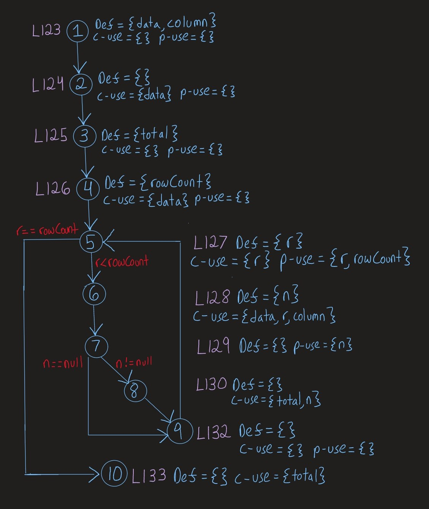

**SENG 438 - Software Testing, Reliability, and Quality**

> **Assignment #3**

**Lab. Report #3 – Code Coverage, Adequacy Criteria and Test Case Correlation**

| Group \#:       | G38  |
|-----------------|---|
| Student Names:  | Tony Vo, Chace Nielson, Chad Holst, Olisehemeka Chukwuma |

**Table of Contents**

- [1 Introduction](#1-introduction)

- [2 Manual data-flow coverage calculations for Constrain and CalculateColumnTotal methods](#2-manual-data-flow-coverage-calculations-for-constrain-and-calculatecolumntotal-methods)

- [3 A detailed description of the testing strategy for the new unit test](#3-a-detailed-description-of-the-testing-strategy-for-the-new-unit-test)

- [4 A high level description of five selected test cases you have designed using coverage information, and how they have increased code coverage](#4-a-high-level-description-of-five-selected-test-cases-you-have-designed-using-coverage-information-and-how-they-have-increased-code-coverage)

- [5 A detailed report of the coverage achieved of each class and method](#5-a-detailed-report-of-the-coverage-achieved-of-each-class-and-method-a-screen-shot-from-the-code-cover-results-in-green-and-red-color-would-suffice)

- [6 Pros and Cons of coverage tools used and Metrics you report](#6-pros-and-cons-of-coverage-tools-used-and-metrics-you-report)

- [7 A comparison on the advantages and disadvantages of requirements-based test generation and coverage-based test generation.](#7-a-comparison-on-the-advantages-and-disadvantages-of-requirements-based-test-generation-and-coverage-based-test-generation)

- [8 A discussion on how the team work/effort was divided and managed](#8-a-discussion-on-how-the-team-workeffort-was-divided-and-managed)

- [9 Any difficulties encountered, challenges overcome, and lessons learned from performing the lab](#9-any-difficulties-encountered-challenges-overcome-and-lessons-learned-from-performing-the-lab)

- [10 Comments/feedback on the lab itself](#10-commentsfeedback-on-the-lab-itself)

# 1 Introduction

In this assignment, we were tasked with using the white-box coverage criteria technique to develop test cases in order to increase the coverage of the test suites we developed in the previous assignment. The same Java framework from the last assignment, JFreeChart, was used for the system under test(SUT), and coverage tools such as EclEmma and Clover were employed to calculate the statement, branch, and method coverage for our test suite. 

After the completion of this assignment, we became more familiar with using coverage tools to measure test suite adequacy and were able to modify our test cases to improve code coverage. We became more acquainted with the advantages and disadvantages of each of the coverage tools we used and grew in our understanding of data-flow coverage and the manual calculation of DU-pair coverage.

# 2 Manual data-flow coverage calculations for Constrain and CalculateColumnTotal methods

This section includes the Data Flow diagrams and calculations for the following two methods: `constrain(double value)` from `Range` and `calculateColumnTotal(Values2D, int)` from `DataUtilities`.

# 3 A detailed description of the testing strategy for the new unit test

Our testing strategy was to use white-box testing to attempt to maximize the statement coverage, branch coverage, and method coverage of our unit tests from assignment 2 and new unit tests in our test suite. Our primary goal was to achieve a minimum of 90% statement coverage, 70% branch coverage, and 60% method coverage for each class under test. A secondary goal of ours was to achieve 100% statement coverage for our assignment 2 unit tests. We had modified our Assignment 2 tests and had achieved this goal through analyzing with the assistance of EclEmma and other coverage tools. Another secondary goal was to achieve 100% condition(method) coverage and around 80% branch coverage in DataUtilities which we were able to accomplish. Our strategy was to look at the source code with Eclemma to determine what statements, branches, and methods were missed. Eclemma highlights statements covered and notifies the user if a branch was missed and explains how many have been missed. We used this information as guidance to modify existing unit tests and create new unit tests. The guidance assisted us with deciding which inputs would satisfy each coverage metric percentage.

# 4 A high level description of five selected test cases you have designed using coverage information, and how they have increased code coverage

5 test cases that increased the coverage which are listed by method and test case number as each method has multiple tests are the following:

# 5 A detailed report of the coverage achieved of each class and method (a screen shot from the code cover results in green and red color would suffice)

Text…

# 6 Pros and Cons of coverage tools used and Metrics you report

Text…

# 7 A comparison on the advantages and disadvantages of requirements-based test generation and coverage-based test generation.

Text…

# 8 A discussion on how the team work/effort was divided and managed

Text…

# 9 Any difficulties encountered, challenges overcome, and lessons learned from performing the lab

Text…

# 10 Comments/feedback on the lab itself

Text…
